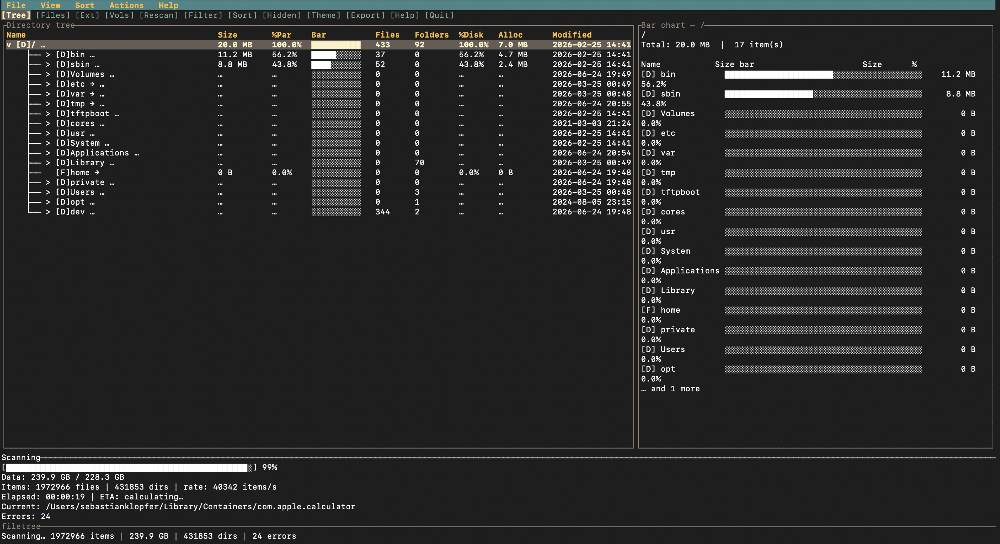

# filetree

**A free, open-source alternative to TreeSize and DaisyDisk for macOS.** filetree is a fast, interactive terminal disk-usage analyzer — find what's eating your disk in seconds, with full keyboard **and mouse** navigation. No subscription, no app to buy, no telemetry.


<p align="center">
  
</p>

## Why filetree?

| | filetree | TreeSize | DaisyDisk |
|---|:---:|:---:|:---:|
| Price | **Free & open source** | Paid / freemium | Paid |
| Native macOS | ✅ | ⚠️ (Windows-first) | ✅ |
| Runs in the terminal (SSH-friendly) | ✅ | ❌ | ❌ |
| Parallel multi-core scan | ✅ | ✅ | ✅ |
| Keyboard **and** mouse | ✅ | ✅ | mouse-first |
| Top-N files / extension breakdown / volumes | ✅ | ✅ | ✅ |
| No telemetry, no account | ✅ | — | — |

Point it at a folder (or your whole disk) and it shows a TreeSize-style sortable tree of folder sizes, a DaisyDisk-style breakdown of what's largest, and lets you reveal or delete the offenders — all without leaving the terminal.

## Install

Install is **`install.sh` only** — it uses rustup/cargo directly for a fast release build. No Homebrew (Brew's `rust` formula pulls LLVM and Python and compiles much slower).

### One-line install (any Mac)

```bash
curl -fsSL https://raw.githubusercontent.com/skdevelopment/filetree-mac/main/install.sh | bash
```

The script will:

- Install Rust via rustup if needed (one-time)
- Run `cargo build --release` and install into `~/.local/bin`
- Add `~/.local/bin` to your PATH

Open a **new terminal tab** (or run `source ~/.zshrc`), then:

```bash
filetree
```

### Already have the repo?

```bash
./install.sh
```

### Override defaults (optional)

| Variable | Default | Purpose |
|----------|---------|---------|
| `FILETREE_MODIFY_PATH` | `1` | Add `~/.local/bin` to shell config |
| `FILETREE_AUTO_INSTALL_RUST` | `1` | Install Rust via rustup if `cargo` is missing |
| `FILETREE_GIT_REF` | `main` | Git branch or tag to install |
| `FILETREE_OPEN_FDA` | `""` | After install: ask to open FDA settings (`1` = open, `0` = print only) |

### Manual install

```bash
cargo build --release
mkdir -p ~/.local/bin
cp target/release/filetree-mac ~/.local/bin/
cat > ~/.local/bin/filetree << 'EOF'
#!/usr/bin/env sh
exec "$(dirname "$0")/filetree-mac" "$@"
EOF
chmod +x ~/.local/bin/filetree ~/.local/bin/filetree-mac
export PATH="$HOME/.local/bin:$PATH"
filetree ~
```

The `filetree` command is a shell wrapper around `filetree-mac` (macOS blocks a Mach-O binary named exactly `filetree`).

## Quick start

```bash
filetree                    # scan whole system disk (/) on macOS
filetree ~                  # scan home directory
filetree ~/Downloads        # scan a specific path
filetree --theme nord ~     # pick a color theme at launch
filetree --version
```

**Themes:** `classic`, `nord`, `gruvbox`, `solarized`, `dracula`, `tokyo-night`, `catppuccin`, `one-dark`, `monokai`, `light`, `monochrome` — or press `t` in the TUI to preview and apply.

## Features

| Feature | Description |
|---------|-------------|
| **Fast parallel scan** | Work-stealing thread pool (rayon) scans every level in parallel; `getattrlistbulk` on macOS |
| **Menu & toolbar** | Clickable `File/View/Sort/Actions/Help` menus and a quick-action toolbar |
| **Mouse support** | Click menus, toolbar, and rows; scroll wheel to navigate |
| **Directory tree** | TreeSize-style expandable tree with per-folder sizes |
| **Chart panel** | Labeled bar chart of selected folder's children (sizes + %) |
| **Size columns** | Allocated size, actual size, % of parent, % of disk, inline bar |
| **Sort** | By name, size, allocated, date, extension, owner, percent |
| **Filter** | Find files/folders by name substring (`/`) |
| **Multiple views** | Tree, Top-100 files (selectable table with full paths), Extension breakdown (ASCII chart), Volumes |
| **Drive list** | All mounted volumes with used/free space bars |
| **Progress** | 6-line scan panel: bytes/items, ETA, current path; brief status bar summary |
| **Refresh** | Rescan selected folder (`r`) or entire tree (`R`) |
| **Delete** | Remove selected item with confirmation (`d`); live progress panel, cancellable (`c`); works from the tree or Top-100 view |
| **Reveal in Finder** | Open selected path in Finder (`f`) |
| **Export** | Save report as `.txt` or `.csv` (`e`) |
| **Symlinks** | Don't follow symlinks by default; toggle with `v` |
| **Hidden files** | Toggle with `H` |
| **Help** | Full shortcut list (`?`) |
| **Status bar** | Total size, item counts, scan path, settings |

## Full Disk Access (required for full scans)

macOS restricts access to protected folders (Mail, Safari data, TCC database, etc.) unless your **terminal app** has **Full Disk Access**.

`install.sh` offers to open the Full Disk Access settings for you right after installing (set `FILETREE_OPEN_FDA=1` to skip the prompt and open it automatically, or `0` to just print instructions). filetree also detects missing access on startup and shows instructions. To grant it manually:

1. Open **System Settings → Privacy & Security → Full Disk Access**
2. Click **+** and add your terminal (**Terminal**, **iTerm**, **Warp**, etc.)
3. Enable the toggle
4. **Quit and restart** the terminal
5. Run `filetree` again

Or press **o** in the FDA dialog to open System Settings directly.

Without FDA, scans still work but some system directories appear empty or inaccessible.

## Cloud storage

Broad scans (`filetree /` or `filetree ~`) skip macOS cloud folders — `~/Library/CloudStorage/*` (iCloud Drive, Google Drive, OneDrive, Dropbox, Nextcloud, …) and `~/Library/Mobile Documents/*`. Their not-downloaded files use ~0 local disk, and scanning them would stall on the network or trigger large downloads. To measure one, scan it directly:

```bash
filetree ~/Library/CloudStorage/GoogleDrive-you@example.com
```

## Keyboard shortcuts

### Navigation
| Key | Action |
|-----|--------|
| `↑`/`↓` or `j`/`k` | Move selection / scroll |
| `←`/`→` or `h`/`l` | Collapse/expand folder |
| `PgUp`/`PgDn` | Scroll one page |
| `Home`/`End` | Jump to first/last row |
| `Enter` | Toggle expand/collapse |
| `g` / `o` | Go to / open path |
| `1`–`4` | Switch views (Tree / Top-N / Extensions / Volumes) |
| `Tab` / `Shift+Tab` | Cycle views |

### Actions
| Key | Action |
|-----|--------|
| `r` | Refresh/rescan selected folder |
| `R` | Rescan entire tree |
| `c` | Cancel active scan or delete |
| `/` | Filter by name |
| `Esc` | Clear filter / close menu |
| `s` | Cycle sort column |
| `S` | Toggle sort direction |
| `d` | Delete selected (confirmation) |
| `f` | Reveal in Finder |
| `e` | Export report |
| `v` | Toggle follow symlinks |
| `H` | Toggle hidden files |
| `t` | Color theme picker (11 themes) |
| `?` | Help screen |
| `q` | Quit |

### Mouse
| Gesture | Action |
|---------|--------|
| Click menu title | Open `File`/`View`/`Sort`/`Actions`/`Help` dropdown |
| Click toolbar button | Run that action (view tabs, rescan, filter, sort, hidden, theme, export, help, quit) |
| Click a row | Select it; click again to expand/collapse (or scan a volume) |
| Scroll wheel | Scroll the list / chart pane |

## Development

```bash
./install.sh              # or: cargo build --release
cargo test                # integration + unit tests
cargo fmt && cargo clippy -- -D warnings
filetree ~                # run TUI
```

Contributor docs: [`docs/`](docs/) (architecture, modules, security, changelog).

## Project structure

```
filetree-mac/
├── install.sh
├── Cargo.toml
├── README.md
├── LICENSE
├── src/                  # Rust TUI
│   ├── main.rs
│   ├── app.rs
│   ├── session.rs
│   ├── ui/               (modal, views, render, input)
│   ├── scanner.rs
│   └── …
└── tests/                # cargo test
```

## Requirements

- macOS 12+ (Intel or Apple Silicon)
- Rust 1.75+ (installed automatically by `install.sh` via rustup if needed)
- Terminal with UTF-8 support (for tree/box drawing characters)

## License

MIT — see [LICENSE](LICENSE).